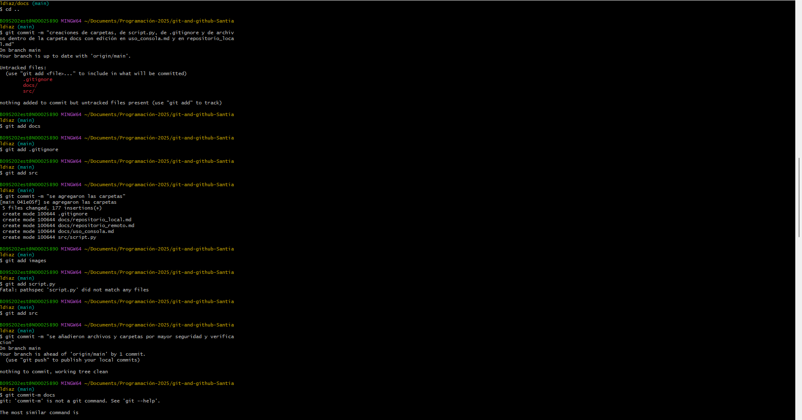

## COMANDOS USADOS
El día de hoy se usaron varios de los comandos mencionados en los textos de la carpeta docs, acá una ejemplificación:
## Imagen 1 
- En esta imagen se pueden apreciar los primeros comandos base, donde se crean los directorios

## Imagen 2
-En esta imagen se evidencian comandos de segunda instancia, tales como la creación de un archivo y la apertura de su editor

## Imagen 3 
- En esta imagen se muestra la respectiva utilización de comandos para agregar cambios y commits

## Imagen 4
- En esta imagen se muestra la respectiva utilización de comandos para ver usos y cantidades de commits

Finalmente se agrega evidencia de los mínimo 10 commits usados:
